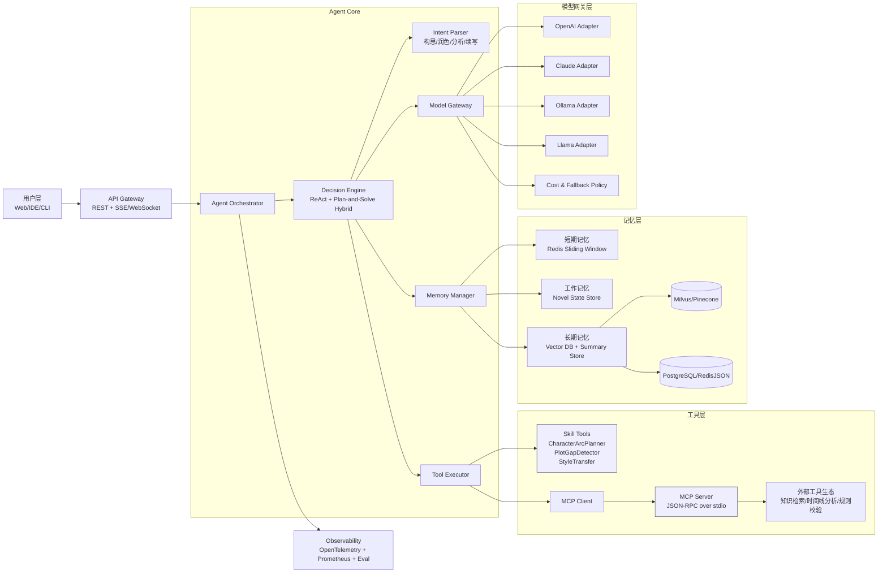
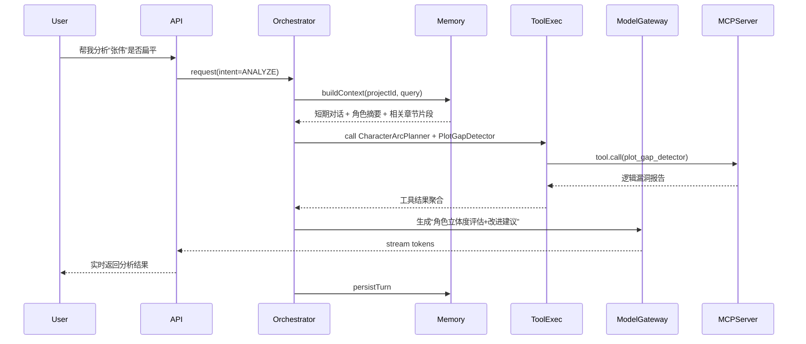
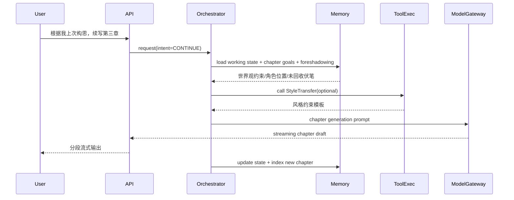
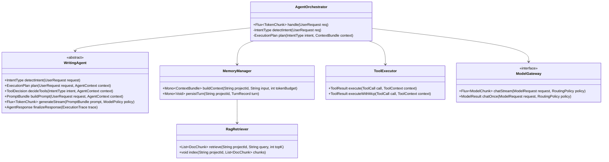

# 小说创作大师 Agent 完整技术方案（Java 21）

> 目标读者：有 15 年 Java 经验的后端开发者  
> 技术关键词：Spring AI / LangChain4j / MCP / RAG / 多模型网关 / 可观测性

---

## 1. 整体架构设计

### 1.1 架构图（Mermaid）



### 1.2 组件职责

- 用户层：输入创作意图，接收流式生成内容。  
- Agent Core：完成意图识别、策略决策、工具调用与记忆融合。  
- 工具层：**Skill 在进程内实现**；**MCP 在进程外或跨语言扩展实现**。  
- 记忆层：短期上下文、工作态状态机、长期知识检索三层协作。  
- 模型网关：统一模型 API、fallback、成本统计、延迟指标。  

---

## 2. 核心模块详细设计

## 2.a Agent 决策引擎

### 模式选择：ReAct + Plan-and-Solve 混合

- ReAct 适合“边推理边工具调用”，适用于分析草稿、找逻辑漏洞。  
- Plan-and-Solve 适合“长链路创作任务”，如章节续写、多步角色弧光规划。  
- 混合策略：  
  - 简单请求（润色/单次问答）走轻量 ReAct。  
  - 复杂请求（续写+一致性约束+多工具）先 Plan，再按子任务 ReAct 执行。  

### `WritingAgent` 抽象类（关键签名）

```java
package ai.storyforge.agent.core;

import reactor.core.publisher.Flux;

public abstract class WritingAgent {

    public abstract IntentType detectIntent(UserRequest request);

    public abstract ExecutionPlan plan(UserRequest request, AgentContext context);

    public abstract ToolDecision decideTools(IntentType intent, AgentContext context);

    public abstract PromptBundle buildPrompt(UserRequest request, AgentContext context);

    public abstract Flux<TokenChunk> generateStream(PromptBundle prompt, ModelPolicy policy);

    public abstract AgentResponse finalizeResponse(ExecutionTrace trace);
}
```

### 意图解析示例（构思/润色/分析/续写）

```java
package ai.storyforge.agent.core;

import java.util.Map;
import java.util.regex.Pattern;

public class IntentRouter {
    private static final Map<IntentType, Pattern> RULES = Map.of(
            IntentType.BRAINSTORM, Pattern.compile("构思|世界观|设定|角色"),
            IntentType.POLISH, Pattern.compile("润色|改写|优化文风"),
            IntentType.ANALYZE, Pattern.compile("分析|是否扁平|关系|伏笔"),
            IntentType.CONTINUE, Pattern.compile("续写|下一章|第三章")
    );

    public IntentType route(String text) {
        return RULES.entrySet().stream()
                .filter(e -> e.getValue().matcher(text).find())
                .map(Map.Entry::getKey)
                .findFirst()
                .orElse(IntentType.GENERAL_CHAT);
    }
}
```

---

## 2.b 工具系统（Skill + MCP）

### `Tool` 接口与 `ToolRegistry`

```java
package ai.storyforge.agent.tool;

public interface Tool<I, O> {
    String name();
    String description();
    Class<I> inputType();
    O execute(I input, ToolContext context);
}
```

```java
package ai.storyforge.agent.tool;

import java.util.Map;
import java.util.concurrent.ConcurrentHashMap;

public class ToolRegistry {
    private final Map<String, Tool<?, ?>> tools = new ConcurrentHashMap<>();

    public void register(Tool<?, ?> tool) {
        tools.put(tool.name(), tool);
    }

    public Tool<?, ?> get(String name) {
        Tool<?, ?> t = tools.get(name);
        if (t == null) throw new IllegalArgumentException("Tool not found: " + name);
        return t;
    }
}
```

### 三个示例工具

```java
package ai.storyforge.agent.tool.impl;

import ai.storyforge.agent.tool.Tool;

public class CharacterArcPlanner implements Tool<CharacterArcInput, CharacterArcOutput> {
    @Override public String name() { return "character_arc_planner"; }
    @Override public String description() { return "规划角色起点-转折-终点弧光"; }
    @Override public Class<CharacterArcInput> inputType() { return CharacterArcInput.class; }
    @Override public CharacterArcOutput execute(CharacterArcInput input, ToolContext context) {
        // 核心逻辑：按章节映射角色目标、冲突、信念变化
        return CharacterArcOutput.empty();
    }
}
```

```java
package ai.storyforge.agent.tool.impl;

import ai.storyforge.agent.tool.Tool;

public class PlotGapDetector implements Tool<PlotGapInput, PlotGapOutput> {
    @Override public String name() { return "plot_gap_detector"; }
    @Override public String description() { return "检测情节因果断裂与动机缺失"; }
    @Override public Class<PlotGapInput> inputType() { return PlotGapInput.class; }
    @Override public PlotGapOutput execute(PlotGapInput input, ToolContext context) {
        // 核心逻辑：事件图构建 + 因果一致性规则
        return PlotGapOutput.empty();
    }
}
```

```java
package ai.storyforge.agent.tool.impl;

import ai.storyforge.agent.tool.Tool;

public class StyleTransfer implements Tool<StyleTransferInput, StyleTransferOutput> {
    @Override public String name() { return "style_transfer"; }
    @Override public String description() { return "按目标文风进行可控改写"; }
    @Override public Class<StyleTransferInput> inputType() { return StyleTransferInput.class; }
    @Override public StyleTransferOutput execute(StyleTransferInput input, ToolContext context) {
        // 核心逻辑：风格约束模板 + 禁止词/句长/节奏控制
        return StyleTransferOutput.empty();
    }
}
```

### MCP Server（JSON-RPC over stdio）示例

```java
package ai.storyforge.mcp.server;

import com.fasterxml.jackson.databind.JsonNode;
import com.fasterxml.jackson.databind.ObjectMapper;
import java.io.*;
import java.nio.charset.StandardCharsets;
import java.util.Map;

public class StdioMcpServer {
    private final ObjectMapper mapper = new ObjectMapper();
    private final Map<String, McpMethodHandler> handlers;

    public StdioMcpServer(Map<String, McpMethodHandler> handlers) {
        this.handlers = handlers;
    }

    public void start() throws Exception {
        try (BufferedReader in = new BufferedReader(new InputStreamReader(System.in, StandardCharsets.UTF_8));
             BufferedWriter out = new BufferedWriter(new OutputStreamWriter(System.out, StandardCharsets.UTF_8))) {
            String line;
            while ((line = in.readLine()) != null) {
                JsonNode req = mapper.readTree(line);
                String method = req.path("method").asText();
                JsonNode id = req.path("id");
                JsonNode params = req.path("params");

                JsonNode result = handlers.getOrDefault(method, McpMethodHandler.notFound()).handle(params);
                JsonNode resp = mapper.createObjectNode()
                        .set("jsonrpc", mapper.getNodeFactory().textNode("2.0"))
                        .set("id", id)
                        .set("result", result);

                out.write(mapper.writeValueAsString(resp));
                out.newLine();
                out.flush();
            }
        }
    }
}
```

```json
{"jsonrpc":"2.0","id":"1","method":"tool.call","params":{"name":"plot_gap_detector","input":{"chapter":"3"}}}
```

---

## 2.c 记忆系统（三层）

### 设计要点

- 短期记忆：Redis List + Token 预算滑动窗口（保留最近 N 轮 + 摘要补偿）。  
- 长期记忆：向量库存 chunk embedding；摘要库存结构化元数据（人物、地点、伏笔）。  
- 工作记忆：当前项目态（角色状态、章节目标、未回收伏笔）用于强约束生成。  

### `MemoryManager` 核心代码

```java
package ai.storyforge.agent.memory;

import reactor.core.publisher.Mono;
import java.util.List;

public class MemoryManager {
    private final ShortTermMemoryStore shortTermStore; // Redis
    private final VectorMemoryStore vectorStore;       // Milvus/Pinecone
    private final SummaryStore summaryStore;           // PostgreSQL/RedisJSON
    private final WorkingStateStore stateStore;        // 当前小说状态

    public Mono<ContextBundle> buildContext(String projectId, String userInput, int tokenBudget) {
        return shortTermStore.window(projectId, tokenBudget)
                .zipWith(vectorStore.retrieve(projectId, userInput, 8))
                .zipWith(summaryStore.load(projectId))
                .zipWith(stateStore.get(projectId))
                .map(tuple -> ContextBundle.of(tuple.getT1(), tuple.getT2(), tuple.getT3(), tuple.getT4()));
    }

    public Mono<Void> persistTurn(String projectId, TurnRecord turn) {
        return shortTermStore.append(projectId, turn)
                .then(summaryStore.upsertFromTurn(projectId, turn))
                .then(vectorStore.indexTurn(projectId, turn))
                .then(stateStore.mergeDelta(projectId, turn.stateDelta()));
    }
}
```

---

## 2.d 模型网关（Adapter 模式）

### 统一接口 + fallback + 成本追踪

```java
package ai.storyforge.agent.model;

import reactor.core.publisher.Flux;

public interface ModelGateway {
    Flux<ModelChunk> chatStream(ModelRequest request, RoutingPolicy policy);
    ModelResult chatOnce(ModelRequest request, RoutingPolicy policy);
}
```

```java
package ai.storyforge.agent.model;

import java.math.BigDecimal;
import java.util.List;

public class AdaptiveModelGateway implements ModelGateway {
    private final List<ModelAdapter> adapters; // OpenAI/Claude/Ollama/Llama
    private final CostTracker costTracker;

    @Override
    public reactor.core.publisher.Flux<ModelChunk> chatStream(ModelRequest request, RoutingPolicy policy) {
        for (ModelAdapter adapter : adapters) {
            if (!policy.allow(adapter.provider())) continue;
            try {
                var stream = adapter.chatStream(request);
                costTracker.recordEstimate(adapter.provider(), request.estimatedTokens(), BigDecimal.ZERO);
                return stream;
            } catch (Exception ex) {
                // fallback to next adapter
            }
        }
        return reactor.core.publisher.Flux.error(new IllegalStateException("No provider available"));
    }

    @Override
    public ModelResult chatOnce(ModelRequest request, RoutingPolicy policy) {
        throw new UnsupportedOperationException("demo");
    }
}
```

```yaml
model:
  routing:
    default: openai-gpt-4o-mini
    fallback: [claude-3-5-sonnet, ollama-llama3.1]
  budget:
    daily-usd-limit: 30
    warn-threshold: 0.8
```

---

## 3. 数据流示例（序列图 + 说明）

### 场景 A：分析“张伟是否扁平”



文字说明（关键点）：

- 从长期记忆召回“张伟”历史出场片段，避免只看当前章导致误判。  
- `CharacterArcPlanner` 给出弧光完整度评分，`PlotGapDetector` 补充动机断层证据。  
- 模型最终回答必须引用“证据片段 + 具体改法（行为/冲突/代价）”。  

### 场景 B：根据上次构思续写第三章



文字说明（关键点）：

- 先读工作记忆中的“未回收伏笔列表”，保障续写连续性。  
- 生成后写回状态（角色位置、情绪值、冲突进度），下一章可直接接续。  

---

## 4. 关键代码骨架（Java 21）

### 4.1 类图（Mermaid）



### 4.2 `AgentOrchestrator` 骨架

```java
package ai.storyforge.agent.core;

import reactor.core.publisher.Flux;
import reactor.core.publisher.Mono;

public class AgentOrchestrator {
    private final WritingAgent writingAgent;
    private final MemoryManager memoryManager;

    public Flux<TokenChunk> handle(UserRequest req) {
        return memoryManager.buildContext(req.projectId(), req.text(), 12000)
                .flatMapMany(ctx -> {
                    IntentType intent = writingAgent.detectIntent(req);
                    ExecutionPlan plan = writingAgent.plan(req, AgentContext.from(ctx));
                    PromptBundle prompt = writingAgent.buildPrompt(req, AgentContext.from(ctx).with(plan));
                    return writingAgent.generateStream(prompt, ModelPolicy.defaultPolicy())
                            .doOnComplete(() -> persist(req, ctx).subscribe());
                });
    }

    private Mono<Void> persist(UserRequest req, ContextBundle ctx) {
        return memoryManager.persistTurn(req.projectId(), TurnRecord.from(req, ctx));
    }
}
```

### 4.3 `ToolExecutor` 骨架

```java
package ai.storyforge.agent.tool;

public class ToolExecutor {
    private final ToolRegistry toolRegistry;
    private final McpClient mcpClient;

    public ToolResult execute(ToolCall call, ToolContext context) {
        if (call.viaMcp()) {
            return executeWithMcp(call, context);
        }
        Tool<Object, Object> tool = (Tool<Object, Object>) toolRegistry.get(call.toolName());
        Object out = tool.execute(call.input(), context);
        return ToolResult.success(call.toolName(), out);
    }

    public ToolResult executeWithMcp(ToolCall call, ToolContext context) {
        return mcpClient.callTool(call.toolName(), call.input());
    }
}
```

### 4.4 向量检索模块（RAG）骨架

```java
package ai.storyforge.agent.rag;

import java.util.List;

public class RagRetriever {
    private final EmbeddingClient embeddingClient;
    private final VectorStore vectorStore;

    public List<DocChunk> retrieve(String projectId, String query, int topK) {
        float[] qVec = embeddingClient.embed(query);
        return vectorStore.search(projectId, qVec, topK);
    }

    public void index(String projectId, List<DocChunk> chunks) {
        for (DocChunk c : chunks) {
            float[] vec = embeddingClient.embed(c.text());
            vectorStore.upsert(projectId, c.id(), vec, c.metadata());
        }
    }
}
```

---

## 5. 技术选型建议（Java 生态）

### 5.1 Agent 框架：LangChain4j vs Spring AI

- LangChain4j 更成熟于 Java Agent 抽象、Tool/Memory 生态，社区案例较多。  
- Spring AI 与 Spring Boot 集成顺滑，企业内可观测、配置、依赖管理更统一。  
- 建议：  
  - 快速 PoC / 强 Agent 功能优先：LangChain4j。  
  - 企业级平台化、统一治理优先：Spring AI（可混合接入 LangChain4j 组件）。  

### 5.2 向量数据库：Milvus（本地） vs Pinecone（云）

- Milvus：本地可控、成本低、适合私有化与大规模离线导入。  
- Pinecone：托管运维简单、弹性扩展快、上线速度高。  
- 建议：开发与私有部署优先 Milvus；云原生 MVP 优先 Pinecone。  

### 5.3 MCP：JSON-RPC over stdio vs WebSocket

- stdio：实现简单、进程内/同机通信低门槛，适合本地工具生态。  
- WebSocket：跨机器、长连接、多客户端协作更强。  
- 建议：先 stdio 打通 Skill/MCP 统一协议，后续按部署形态演进 WebSocket。  

### 5.4 异步处理：虚拟线程 vs Reactor

- 虚拟线程：迁移成本低，适合同步思维的 Java 团队。  
- Reactor：在高并发流式 token 管道更强，背压与组合操作成熟。  
- 建议：  
  - Agent 主流程（工具调用、I/O）可先虚拟线程化。  
  - 流式输出和模型 token 处理保持 Reactor（或 WebFlux）以简化 SSE。  

---

## 6. 落地路线图（4 个迭代）

### 迭代 1：单模型 + 无状态 + 1 个工具（2 周）

- 接 OpenAI 单模型；完成 `AgentOrchestrator` 基础路由。  
- 实现 1 个工具（`CharacterArcPlanner`）进程内调用。  
- 提供 CLI 或简易 Web 界面，支持流式输出。  

### 迭代 2：向量记忆 + 3 个核心工具（2~3 周）

- 引入 `MemoryManager` 三层结构最小可用版本。  
- 上线 `PlotGapDetector` 与 `StyleTransfer`。  
- 接入 Milvus/Pinecone，完成章节分块、索引、召回。  

### 迭代 3：MCP 化 + 多模型切换（2 周）

- 工具接口 MCP 化，支持外部进程工具。  
- 上线 `ModelGateway` 动态路由与 fallback。  
- 增加成本监控（按请求/项目维度）。  

### 迭代 4：流式 UI + 可观测性（2 周）

- 前端提供章节级实时生成与中断重试。  
- 接 OpenTelemetry + Prometheus + Grafana。  
- 加入离线评测集（角色一致性、伏笔回收率、逻辑漏洞率）。  

---

## 7. Java 开发者常见坑与规避策略

- 上下文丢失：异步链路未传递 `traceId/projectId`，导致记忆写错项目。  
  - 规避：统一 `AgentContext` + Reactor `Context` 注入。  
- 工具调用幻觉：模型声称“已调用工具”但实际没执行。  
  - 规避：工具执行以系统侧事件为准，结果由 `ToolExecutor` 回填。  
- 长文本截断：仅按字符截断，破坏语义与实体边界。  
  - 规避：按 token + 语义 chunk + 摘要补偿。  
- ReAct 循环过深：模型反复思考/调用同工具。  
  - 规避：最大迭代数、同工具幂等缓存、超时熔断。  
- 向量污染：把低质量草稿直接入库，召回噪声高。  
  - 规避：入库前清洗、质量打分、分层索引（草稿/定稿）。  
- 成本失控：多模型 fallback 未设预算，峰值调用激增。  
  - 规避：项目预算配额 + 低成本模型降级策略。  

---

## 可改进点（对原始需求的增强）

- 建议增加“创作约束 DSL”（禁用设定、人物口癖、剧情边界），减少模型漂移。  
- 建议增加“章节验收器”（一致性得分 < 阈值则自动重写）。  
- 建议把“角色关系图/时间线”输出标准化为 JSON，便于 UI 可视化与回归测试。  

```json
{
  "projectId": "novel-001",
  "chapter": 3,
  "characters": [
    {"name": "张伟", "goal": "复仇", "emotion": "压抑", "arcStage": "midpoint"}
  ],
  "foreshadowing": [
    {"id": "fs-12", "status": "unresolved", "hint": "旧怀表来源"}
  ]
}
```

