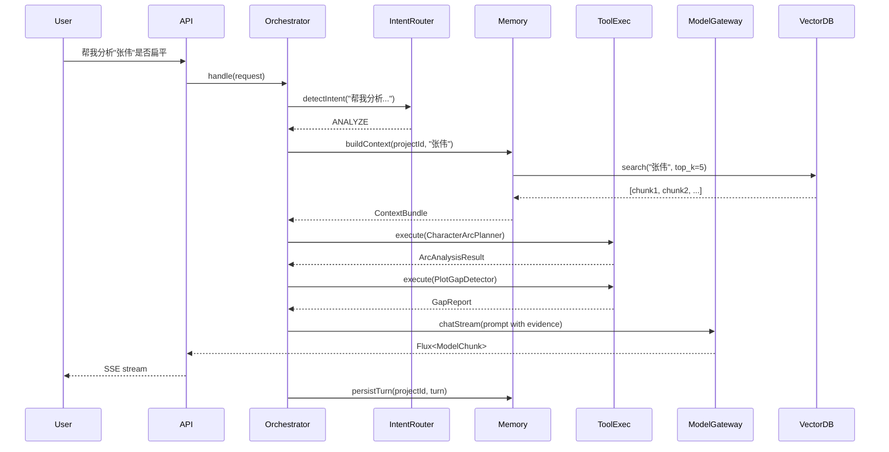
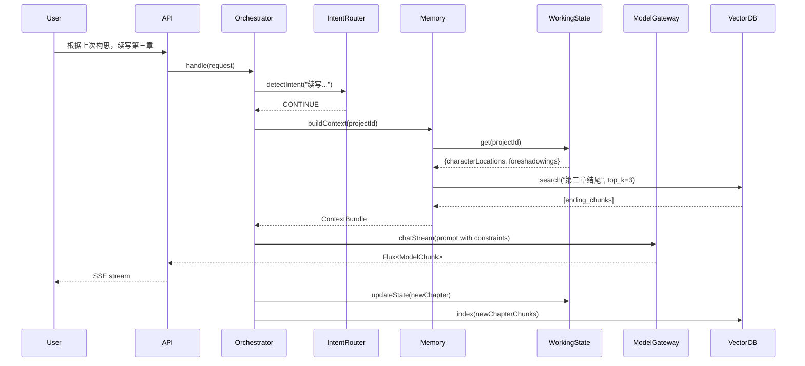

# 小说创作大师 Agent 技术规格说明书

**版本**: 1.0  
**日期**: 2026-04-02  
**作者**: AI Agent 架构师

---

## 1. 项目概述

### 1.1 目标

构建一个智能小说创作辅助系统，通过 AI Agent 技术帮助作者完成：
- 构思角色、情节、世界观
- 分析和优化已有内容
- 续写章节并保持一致性
- 检测逻辑漏洞和情节断层

### 1.2 用户角色

**主要用户**: 小说作者（个人开发者）
- 有一定的编程基础
- 希望通过 AI 提升创作效率
- 关注成本控制（每日预算 < 1 美元）

### 1.3 核心价值

1. **智能辅助**: 不是简单生成文本，而是理解创作意图，提供有深度的建议
2. **一致性保障**: 通过三层记忆系统，确保长篇小说的角色、情节、世界观一致
3. **可扩展性**: 支持 MCP 协议，可接入外部工具生态
4. **成本可控**: 多模型 fallback + 成本追踪，避免意外超支

---

## 1.4 核心创新点

本项目在传统 AI 写作助手基础上，引入五大创新技术，显著提升叙事质量和用户控制力：

### 创新点 1：角色驱动的情节生成（Character-Driven Plotting）

**创新性**: ⭐⭐⭐ (成熟度: 3/5)

**核心思想**: 
- 让每个主要角色拥有独立的"微型 Agent"，在 Agent Core 中运行角色模拟器
- 每个角色具备：目标（Goal）、信念（Beliefs）、情绪状态（Emotion）、记忆（个性化解读）
- 情节由角色决策涌现，而非上帝视角生成

**技术实现**:
```java
class CharacterMind {
    Map<String, CharacterState> states;
    Decision resolveConflict(Event e);  // 多角色冲突时，按性格权重决定行动
}
```

**预期效果**: 
- 角色行为更符合性格逻辑
- 情节转折更自然
- 类似《模拟人生》的叙事涌现

---

### 创新点 2：反事实推理（Counterfactual Reasoning）用于伏笔设计

**创新性**: ⭐⭐⭐⭐ (成熟度: 2/5)

**核心思想**:
- 给定当前情节 C，自动生成"如果某个事件没发生"的变体 C'
- 推理 C' 会导致哪些后续事件无法发生，反推必须埋下的伏笔
- 把伏笔设计从"灵光一现"变为逻辑必需性推导

**技术实现**:
```java
class CounterfactualTool implements Tool<Input, ForeshadowingList> {
    // 使用轻量级模型（如本地 Llama 3）快速生成反事实路径
    List<Foreshadowing> inferRequiredForeshadowings(Plot currentPlot);
}
```

**预期效果**:
- 伏笔埋设更系统化
- 情节严密性大幅提升
- 减少逻辑漏洞

---

### 创新点 3：多模态故事板（Storyboard as Latent Space）

**创新性**: ⭐⭐⭐⭐ (成熟度: 4/5)

**核心思想**:
- 引入隐式故事板，用图结构表示场景、时间戳、角色移动、事件因果
- 生成前先在图上做路径规划，再渲染成文字
- 结合符号规划（PDDL/HTN）+ 神经生成

**技术实现**:
```java
interface StoryPlanner {
    ActionSequence plan(Goal goal, StoryState state, Constraints constraints);
}
```

**预期效果**:
- 空间/时间一致性保证
- 避免"角色瞬移"等矛盾
- 可解释性强

---

### 创新点 4：交互式叙事韧性（Interactive Narrative Resilience）

**创新性**: ⭐⭐⭐⭐⭐ (成熟度: 2/5)

**核心思想**:
- 每生成 1~2 段，自动保存因果依赖图
- 用户提出修改约束时，计算最小回滚点，只重新生成违反约束的部分
- 类似 Git 的 rebase 机制

**技术实现**:
```java
class CausalGraphStore {
    void saveDependencies(Paragraph p, List<Dependency> deps);
    RollbackPoint findMinimalRollback(Constraint violation);
}

Mono<Flux<TokenChunk>> patch(UserRequest patchConstraint, String fromChapter);
```

**预期效果**:
- 大幅提升用户控制感
- 减少重复生成成本
- 支持精细化编辑

---

### 创新点 5：元叙事约束求解器（Meta-Narrative Constraint Solver）

**创新性**: ⭐⭐⭐⭐ (成熟度: 4/5)

**核心思想**:
- 将叙事元素（对话次数、伏笔长度、禁止词）建模为变量
- 将用户约束转化为线性不等式
- 使用约束求解器（OptaPlanner/Choco）输出可行解空间

**技术实现**:
```java
class ConstraintSolver {
    NarrativeSpec solve(Set<UserConstraint> constraints, StoryState state);
    // 输出：chapterLengthRange, minDialogueCount, forbiddenWordsSet...
}
```

**预期效果**:
- 满足复杂约束（字数、对话次数、伏笔回收）
- 自动处理约束冲突
- 适合专业作家和游戏剧情生成

---

### 创新点实施优先级

| 创新点 | 成熟度 | 实施难度 | 优先级 | 建议迭代 |
|--------|--------|---------|--------|---------|
| 隐式故事板 | 4/5 | 中 | P0 | 迭代 2-3 |
| 元叙事约束求解器 | 4/5 | 中 | P1 | 迭代 3-4 |
| 角色驱动情节 | 3/5 | 高 | P1 | 迭代 4+ |
| 反事实推理 | 2/5 | 高 | P2 | 迭代 5+ |
| 叙事韧性 | 2/5 | 高 | P2 | 迭代 5+ |

---

## 2. 技术架构约束

### 2.1 核心技术栈

| 组件 | 技术选型 | 版本要求 | 说明 |
|------|---------|---------|------|
| 语言 | Java | 21+ | 使用虚拟线程、Record、Pattern Matching |
| Agent 框架 | LangChain4j | 0.35+ | 核心编排、工具调用、记忆管理 |
| 模型网关 | LangChain4j OpenAiChatModel | - | 初期简化方案 |
| 向量数据库 | Milvus | 2.3+ | 本地部署，存储章节 embedding |
| 缓存 | Redis | 7.0+ | 短期记忆存储 |
| 关系数据库 | PostgreSQL | 15+ | JSONB 存储工作记忆、摘要 |
| 通信协议 | REST + SSE | - | 流式输出支持 |
| 工具协议 | MCP (JSON-RPC over stdio) | - | 外部工具集成 |

### 2.2 架构原则

1. **职责分离**: Agent 核心逻辑（LangChain4j）与模型网关（可选 Spring AI）独立模块化
2. **渐进式演进**: 初期简化实现，后期按需引入复杂组件
3. **可观测优先**: 所有模型调用、工具执行必须有 traceId 和日志
4. **成本透明**: 每次请求记录 token 数和预估费用

### 2.3 部署环境

- **开发环境**: 本地 macOS/Linux
- **运行环境**: Docker Compose（Milvus + Redis + PostgreSQL）
- **模型服务**: 智谱 AI API（OpenAI 兼容模式）

---

## 3. 功能需求规格

### 3.1 意图识别

#### 3.1.1 意图类型定义

| 意图类型 | 触发关键词 | 所需上下文 | 示例输入 |
|---------|-----------|-----------|---------|
| **BRAINSTORM** | 构思、世界观、设定、角色、创建、设计 | 无特殊要求 | "帮我构思一个科幻世界观" |
| **POLISH** | 润色、改写、优化文风、修饰 | 需要用户提供待润色文本 | "润色这段描写" |
| **ANALYZE** | 分析、是否扁平、关系、伏笔、漏洞 | 需要从长期记忆检索相关内容 | "分析张伟是否扁平" |
| **CONTINUE** | 续写、下一章、第三章、接着写 | 需要工作记忆 + 长期记忆 | "续写第三章" |
| **GENERAL_CHAT** | 其他所有输入 | 无特殊要求 | "你好" |

#### 3.1.2 实现方式

**阶段一（MVP）**: 基于规则的关键词匹配
```java
Pattern.compile("构思|世界观|设定|角色")
```

**阶段二（优化）**: 使用小模型分类（GLM-4-Flash）

---

### 3.2 工具规格

#### 3.2.1 CharacterArcPlanner（角色弧光规划器）

**描述**: 分析角色的成长轨迹，规划起点-转折-终点弧光

**输入参数 (JSON Schema)**:
```json
{
  "$schema": "http://json-schema.org/draft-07/schema#",
  "type": "object",
  "properties": {
    "characterName": {
      "type": "string",
      "description": "角色名称"
    },
    "chapters": {
      "type": "array",
      "items": {
        "type": "object",
        "properties": {
          "chapterId": {"type": "string"},
          "content": {"type": "string"}
        }
      },
      "description": "相关章节内容"
    },
    "analysisDepth": {
      "type": "string",
      "enum": ["basic", "detailed"],
      "default": "basic"
    }
  },
  "required": ["characterName", "chapters"]
}
```

**输出格式**:
```json
{
  "characterName": "张伟",
  "arcScore": 0.65,
  "stages": [
    {
      "chapter": "第1章",
      "goal": "生存",
      "conflict": "失业危机",
      "belief": "金钱至上"
    },
    {
      "chapter": "第5章",
      "goal": "自我实现",
      "conflict": "道德困境",
      "belief": "价值重估"
    }
  ],
  "suggestions": [
    "建议在第3章增加一个转折事件",
    "当前信念转变缺乏铺垫"
  ]
}
```

**错误处理**:
- 角色未找到 → 返回空结果 + `errorCode: "CHARACTER_NOT_FOUND"`
- 章节内容不足 → 返回部分分析 + `warning: "INSUFFICIENT_DATA"`

---

#### 3.2.2 PlotGapDetector（情节漏洞检测器）

**描述**: 检测情节因果断裂、动机缺失、时间线冲突

**输入参数 (JSON Schema)**:
```json
{
  "$schema": "http://json-schema.org/draft-07/schema#",
  "type": "object",
  "properties": {
    "chapters": {
      "type": "array",
      "items": {
        "type": "object",
        "properties": {
          "chapterId": {"type": "string"},
          "events": {
            "type": "array",
            "items": {
              "type": "object",
              "properties": {
                "event": {"type": "string"},
                "characters": {"type": "array", "items": {"type": "string"}},
                "location": {"type": "string"},
                "timestamp": {"type": "string"}
              }
            }
          }
        }
      }
    },
    "focusType": {
      "type": "string",
      "enum": ["causality", "motivation", "timeline", "all"],
      "default": "all"
    }
  },
  "required": ["chapters"]
}
```

**输出格式**:
```json
{
  "gaps": [
    {
      "type": "CHARACTER_TELEPORT",
      "severity": "high",
      "description": "张伟在第3章结尾在北京，第4章开头突然在上海",
      "location": {
        "chapter": "第3-4章",
        "evidence": ["第3章: 张伟站在北京街头", "第4章: 张伟推开上海的家门"]
      },
      "suggestion": "增加过渡场景或说明交通方式"
    },
    {
      "type": "MOTIVATION_MISSING",
      "severity": "medium",
      "description": "李明突然背叛主角，缺乏动机铺垫",
      "suggestion": "在前文增加李明的心理活动或利益冲突暗示"
    }
  ],
  "summary": {
    "totalGaps": 2,
    "highSeverity": 1,
    "mediumSeverity": 1
  }
}
```

**错误处理**:
- 事件提取失败 → 跳过该章节，继续分析其他章节
- 数据格式错误 → 返回 `errorCode: "INVALID_FORMAT"`

---

#### 3.2.3 StyleTransfer（风格迁移）

**描述**: 按目标文风进行可控改写

**输入参数 (JSON Schema)**:
```json
{
  "$schema": "http://json-schema.org/draft-07/schema#",
  "type": "object",
  "properties": {
    "text": {
      "type": "string",
      "description": "待改写的文本"
    },
    "targetStyle": {
      "type": "string",
      "enum": ["古风", "现代", "科幻", "悬疑", "幽默"],
      "description": "目标风格"
    },
    "constraints": {
      "type": "object",
      "properties": {
        "preserveKeywords": {
          "type": "array",
          "items": {"type": "string"},
          "description": "必须保留的关键词"
        },
        "sentenceLengthRange": {
          "type": "object",
          "properties": {
            "min": {"type": "integer"},
            "max": {"type": "integer"}
          }
        },
        "forbiddenWords": {
          "type": "array",
          "items": {"type": "string"},
          "description": "禁止使用的词汇"
        }
      }
    }
  },
  "required": ["text", "targetStyle"]
}
```

**输出格式**:
```json
{
  "rewrittenText": "改写后的文本内容...",
  "styleScore": 0.82,
  "changes": [
    {
      "original": "他说",
      "rewritten": "他沉声道",
      "reason": "增强古风语气"
    }
  ]
}
```

**错误处理**:
- 文本过长（> 2000 token）→ 返回 `errorCode: "TEXT_TOO_LONG"`
- 风格不支持 → 返回 `errorCode: "UNSUPPORTED_STYLE"`

---

### 3.3 记忆系统规格

#### 3.3.1 短期记忆（对话上下文）

**存储**: Redis List  
**Key 格式**: `storyforge:shortterm:{projectId}`  
**数据结构**:
```json
[
  {
    "role": "user",
    "content": "帮我分析张伟是否扁平",
    "timestamp": "2026-04-02T10:30:00Z"
  },
  {
    "role": "assistant",
    "content": "根据分析...",
    "timestamp": "2026-04-02T10:30:05Z"
  }
]
```

**滑动窗口策略**:
- 默认保留最近 10 轮对话
- 超出时，将旧对话压缩为摘要（使用 GLM-4-Flash）
- Token 预算: 3000 tokens（约 6 轮完整对话 + 摘要）

---

#### 3.3.2 长期记忆（小说知识库）

**存储**: Milvus + PostgreSQL

**分块策略**:
- 按**场景**分块（不是按段落或固定 token 数）
- 每个场景包含：时间、地点、人物、事件
- 平均每块 300-500 tokens

**Embedding 模型**: 智谱 embedding-2（OpenAI 兼容）

**索引字段**:
```json
{
  "id": "chunk_001",
  "projectId": "novel_123",
  "chapterId": "chapter_3",
  "text": "场景文本内容...",
  "embedding": [0.123, 0.456, ...],
  "metadata": {
    "characters": ["张伟", "李明"],
    "location": "北京",
    "timestamp": "2026-04-01T10:00:00Z",
    "eventType": "conflict"
  }
}
```

**检索策略**:
- Top-k: 5
- 相似度阈值: 0.7
- 混合检索: 向量检索 + 元数据过滤（可选）

---

#### 3.3.3 工作记忆（当前小说状态）

**存储**: PostgreSQL JSONB  
**表结构**:
```sql
CREATE TABLE working_memory (
  project_id VARCHAR(64) PRIMARY KEY,
  state JSONB NOT NULL,
  updated_at TIMESTAMP DEFAULT NOW()
);
```

**状态结构**:
```json
{
  "currentChapter": 3,
  "chapterGoal": "张伟发现真相",
  "characterLocations": {
    "张伟": "北京",
    "李明": "上海"
  },
  "foreshadowings": [
    {
      "id": "fs_001",
      "description": "张伟收到的神秘信件",
      "plantedChapter": 1,
      "resolved": false
    }
  ],
  "activeConflicts": [
    {
      "type": "interpersonal",
      "parties": ["张伟", "李明"],
      "status": "escalating"
    }
  ]
}
```

---

### 3.4 模型网关规格

#### 3.4.1 统一接口

```java
public interface ModelGateway {
    Flux<ModelChunk> chatStream(ModelRequest request, RoutingPolicy policy);
    ModelResult chatOnce(ModelRequest request, RoutingPolicy policy);
}
```

#### 3.4.2 模型配置

```yaml
model:
  providers:
    - name: glm-4.7-flash
      endpoint: https://open.bigmodel.cn/api/paas/v4
      model: glm-4-flash
      maxTokens: 4096
      temperature: 0.7
      costPer1kTokens: 0.0001  # USD
      
    - name: glm-4.5-flash
      endpoint: https://open.bigmodel.cn/api/paas/v4
      model: glm-4-flash
      maxTokens: 4096
      temperature: 0.7
      costPer1kTokens: 0.00008
      
  routing:
    default: glm-4.7-flash
    fallback: [glm-4.5-flash]
    
  budget:
    dailyLimitUsd: 1.0
    warnThreshold: 0.8
```

#### 3.4.3 Fallback 策略

1. 主模型调用失败（超时/错误）→ 自动切换备选模型
2. 所有模型失败 → 返回友好错误信息
3. 成本超限 → 拒绝请求 + 日志告警

---

### 3.5 MCP Server 规格

#### 3.5.1 协议定义

**传输层**: JSON-RPC 2.0 over stdio

**请求格式**:
```json
{
  "jsonrpc": "2.0",
  "id": "1",
  "method": "tools/call",
  "params": {
    "name": "character_arc_planner",
    "arguments": {
      "characterName": "张伟",
      "chapters": [...]
    }
  }
}
```

**成功响应**:
```json
{
  "jsonrpc": "2.0",
  "id": "1",
  "result": {
    "characterName": "张伟",
    "arcScore": 0.65,
    ...
  }
}
```

**错误响应**:
```json
{
  "jsonrpc": "2.0",
  "id": "1",
  "error": {
    "code": -32602,
    "message": "Invalid params: characterName is required"
  }
}
```

#### 3.5.2 支持的方法

| 方法 | 说明 |
|------|------|
| `tools/list` | 列出所有可用工具 |
| `tools/call` | 调用指定工具 |

---

## 4. 数据流规格

### 4.1 场景A：分析角色是否扁平



**关键点**:
1. 向量检索召回"张伟"相关片段，避免只看当前章
2. 工具调用并行执行（CharacterArcPlanner + PlotGapDetector）
3. 模型生成时要求引用证据片段

---

### 4.2 场景B：续写第三章



**关键点**:
1. 工作记忆保障续写连续性（角色位置、未回收伏笔）
2. 检索上一章结尾片段，保证连贯性
3. 生成后更新状态 + 索引新章节

---

## 5. 非功能需求规格

### 5.1 性能指标

| 指标 | 目标值 | 测量方法 |
|------|--------|---------|
| 首token延迟 | < 3秒 | 从请求到第一个token返回 |
| 工具执行时间 | < 5秒 | 单个工具调用耗时 |
| 向量检索延迟 | < 500ms | Milvus 查询耗时 |
| 总响应时间 | < 30秒 | 包含所有工具调用和模型生成 |

### 5.2 可观测性

**日志规范**:
```java
log.info("[traceId={}] Model call: model={}, tokens={}, cost=${}", 
         traceId, modelName, tokenCount, cost);
```

**指标收集**:
- 模型调用次数（按模型分组）
- Token 消耗总量
- 工具调用成功率
- 平均响应时间

### 5.3 成本控制

- 每日预算: 1.0 USD
- 告警阈值: 0.8 USD
- 超限策略: 拒绝请求 + 日志告警

---

## 6. 错误处理与降级规格

### 6.1 错误处理矩阵

| 错误类型 | 处理策略 | 用户提示 |
|---------|---------|---------|
| 模型调用超时（30s） | 重试1次 → 切换备选模型 | "正在切换模型..." |
| 所有模型失败 | 返回错误 | "抱歉，服务暂时不可用" |
| 工具执行异常 | 记录日志，返回空结果 | "部分分析功能暂时不可用" |
| 向量检索失败 | 降级为关键词检索 | 无提示（透明降级） |
| 工作记忆读取失败 | 使用默认空状态 | "未找到项目状态，已重置" |
| 成本超限 | 拒绝请求 | "今日预算已用完，请明天再试" |

### 6.2 降级策略

**向量检索降级**:
```java
List<DocChunk> chunks;
try {
    chunks = vectorStore.search(query, topK);
} catch (Exception e) {
    log.warn("[traceId={}] Vector search failed, fallback to keyword", traceId);
    chunks = keywordSearch(query, topK);  // 简单实现
}
```

---

## 7. 验收标准

### 7.1 功能验收

- [ ] 用户能通过命令行与 Agent 对话，完成至少 3 轮交互
- [ ] Agent 能正确识别 5 种意图（准确率 > 80%）
- [ ] Agent 能调用 CharacterArcPlanner 并输出弧光分析
- [ ] Agent 能检测到"角色瞬移"类逻辑漏洞
- [ ] Agent 能根据上次续写内容，自动更新角色位置和伏笔列表
- [ ] 流式输出正常，无卡顿
- [ ] 日志中包含 traceId 和每次模型调用的 token 费用

### 7.2 性能验收

- [ ] 首token延迟 < 3秒（P95）
- [ ] 单次请求总耗时 < 30秒（P95）

### 7.3 成本验收

- [ ] 成本追踪功能正常
- [ ] 每日预算限制生效

---

## 8. 迭代路线图

### 迭代 1：MVP（2周）

**目标**: 单模型 + 无状态 + 1 个工具

**交付物**:
- AgentOrchestrator 基础路由
- 意图识别（规则匹配）
- CharacterArcPlanner 工具（进程内调用）
- CLI 界面 + 流式输出

### 迭代 2：记忆系统（2-3周）

**目标**: 三层记忆 + 3 个核心工具

**交付物**:
- MemoryManager 三层结构
- PlotGapDetector + StyleTransfer
- Milvus 集成 + 章节分块索引

### 迭代 3：MCP + 多模型（2周）

**目标**: 工具 MCP 化 + 模型 fallback

**交付物**:
- MCP Server（JSON-RPC over stdio）
- ModelGateway 动态路由
- 成本追踪 + 预算限制

### 迭代 4：优化与扩展（持续）

**目标**: 性能优化 + 新工具

**交付物**:
- 意图识别升级（小模型分类）
- 新工具（时间线分析、关系图谱）
- Web 界面（可选）

---

## 附录

### A. 数据模型定义

#### A.1 项目实体

```java
public record NovelProject(
    String projectId,
    String title,
    String author,
    LocalDateTime createdAt,
    WorkingState workingState
) {}
```

#### A.2 章节实体

```java
public record Chapter(
    String chapterId,
    String projectId,
    int chapterNumber,
    String title,
    String content,
    List<String> characters,
    String location,
    LocalDateTime createdAt
) {}
```

### B. 配置文件示例

```yaml
storyforge:
  memory:
    shortterm:
      redis:
        host: localhost
        port: 6379
      windowSize: 10
      
    longterm:
      milvus:
        host: localhost
        port: 19530
        collection: novel_chunks
        
    working:
      postgres:
        url: jdbc:postgresql://localhost:5432/storyforge
        username: storyforge
        password: ${DB_PASSWORD}
        
  tools:
    characterArcPlanner:
      enabled: true
    plotGapDetector:
      enabled: true
    styleTransfer:
      enabled: true
```

### C. 测试用例

#### C.1 角色瞬移检测

**输入**:
- 第3章: "张伟站在北京街头，望着远方的霓虹灯"
- 第4章: "张伟推开上海的家门，疲惫地坐在沙发上"

**预期输出**:
```json
{
  "type": "CHARACTER_TELEPORT",
  "severity": "high",
  "description": "张伟在第3章结尾在北京，第4章开头突然在上海"
}
```
